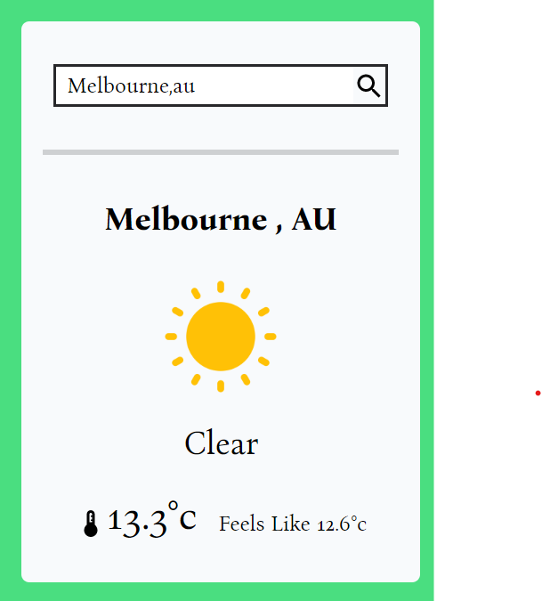

# Weather report app (Tailwind)

- Live Site URL: [Live site](https://your-live-site-url.com)

## Table of contents

- [Overview](#overview)
  - [The challenge](#the-challenge)
  - [Screenshot](#screenshot)
- [My process](#my-process)
  - [Built with](#built-with)
  - [Continued development](#continued-development)
- [Author](#author)
- [Acknowledgments](#acknowledgments)

## Overview

### The challenge

Users should be able to:

- View the optimal layout for the site depending on their device's screen size
- See hover states for all interactive elements on the page
- See the weather information after search by city or location name
- See the hint after search the wrong keyword

### Screenshot

## My process

### Built with

- Semantic HTML5 markup
- Tailwind CSS custom properties
- Flexbox
- React.js
- Weather API

### Continued development

Use this section to outline areas that you want to continue focusing on in future projects. These could be concepts you're still not completely comfortable with or techniques you found useful that you want to refine and perfect.

## Author

- Frontend Mentor - [@Tiff Lee](https://www.frontendmentor.io/profile/tifflee7784)
- Twitter - [@CodeTiffanyL](https://twitter.com/CodeTiffanyL)

## Acknowledgments

This is where you can give a hat tip to anyone who helped you out on this project. Perhaps you worked in a team or got some inspiration from someone else's solution. This is the perfect place to give them some credit.

